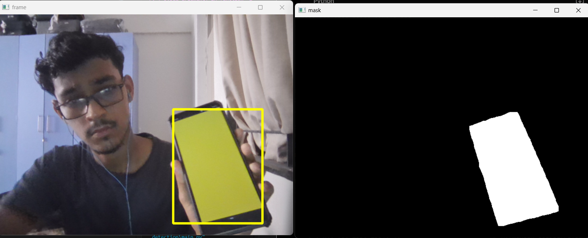

 # Real-Time Color Detection & Tracking with OpenCV

A fast, lightweight Python application that performs real-time color detection and object tracking through a live webcam feed using OpenCV and HSV color segmentation.
 
---

## 📌 Project Overview

This project isolates and tracks specific colors (configured for **Yellow** by default) in real time. It converts the input BGR webcam feed into the **HSV (Hue, Saturation, Value)** color space, generates a binary mask based on calibrated threshold bounds, extracts the bounding coordinates, and draws a tracking bounding box over the detected object.

---

## 📸 Preview



---

## ✨ Features

- **Real-Time Video Processing:** Captures and processes frames dynamically at camera frame rate.
- **Robust Color Space (HSV):** Separates chromatic content from luminance to maintain tracking under varying lighting conditions.
- **Visual Feedback:** Displays both the primary annotated tracking feed and the underlying binary mask view.
- **Easy Color Customization:** Simple numpy array thresholding allows quick switching to detect any color (Red, Green, Blue, etc.).

---

## 📁 Project Structure

```text
Color-Detection/
│
├── assets/
│   └── preview.png         # Screenshot of live preview
│
├── main.py                      # Main detection and tracking script
├── requirements.txt             # Project dependencies
└── README.md                    # Project documentation
```

---

## ⚙️ Installation & Setup

### 1. Clone the Repository
```bash
git clone https://github.com/Mayank-Singh-X1/ColorDetection.git
cd ColorDetection
```

### 2. Set Up a Virtual Environment (Recommended)

**Windows (PowerShell):**
```powershell
python -m venv .venv
.venv\Scripts\Activate.ps1
```

**macOS / Linux:**
```bash
python3 -m venv .venv
source .venv/bin/activate
```

### 3. Install Dependencies
```bash
pip install -r requirements.txt
```

---

## 🚀 How to Run

Execute the main script:
```bash
python main.py
```

- **Exit Application:** Press <kbd>Q</kbd> on your keyboard while focusing on any of the display windows.

---

## 🎨 How It Works

1. **BGR to HSV Conversion:** Video frames from the webcam (`cv2.VideoCapture`) are converted from standard BGR to HSV color space using `cv2.cvtColor`.
2. **Color Masking:** `cv2.inRange()` evaluates each pixel against defined `lower_bound` and `upper_bound` arrays, setting matching pixels to `255` (White) and others to `0` (Black).
3. **Bounding Box Extraction:** Pixel boundaries are calculated from the binary mask to determine top-left `(x1, y1)` and bottom-right `(x2, y2)` coordinates.
4. **Overlay Rendering:** `cv2.rectangle()` overlays the bounding box directly onto the live feed.

---

## 🛠️ Customizing the Target Color

To detect a different color, modify the `lower_bound` and `upper_bound` arrays in `main.py`:

```python
# --- Yellow (Default) ---
lower_bound = np.array([20, 110, 60])
upper_bound = np.array([35, 255, 255])

# --- Green ---
# lower_bound = np.array([36, 100, 100])
# upper_bound = np.array([85, 255, 255])

# --- Blue ---
# lower_bound = np.array([90, 100, 100])
# upper_bound = np.array([130, 255, 255])
```

---

## 📦 Requirements

- `opencv-python`
- `numpy`
- `Pillow`

---

## 📜 License

Distributed under the MIT License. See `LICENSE` for more information.